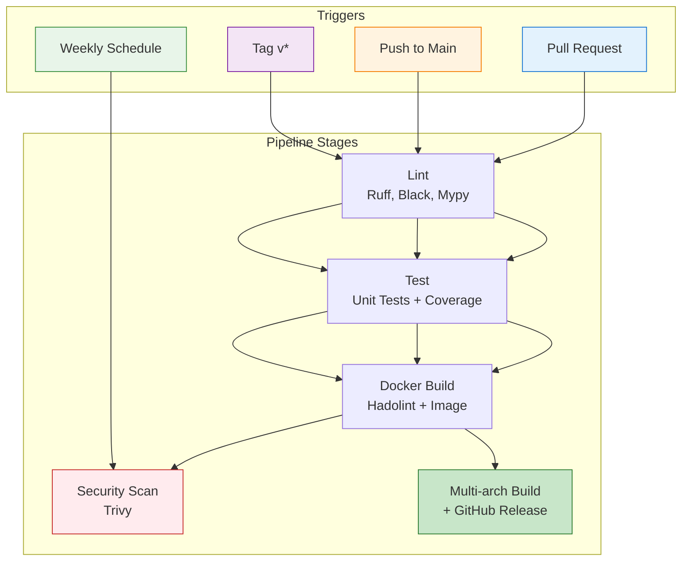

# CI/CD Workflow

This document explains the GitHub Actions CI/CD pipeline for web-to-openwebui.

## Workflow Diagram



## What Runs When

### Pull Request (Fast Feedback - ~5 min)
**Goal:** Quick validation for developers

✅ **Runs:**
- Python linting (Ruff, Black, Mypy)
- Unit tests with coverage reporting
- Docker build validation (single-arch amd64)
- Hadolint Dockerfile linting

❌ **Skipped:**
- Security scanning (too slow for PR feedback)
- Multi-arch builds
- Push to registry

### Push to Main (Security Validation - ~10 min)
**Goal:** Ensure codebase is secure before releases

✅ **Runs:**
- Everything from PR workflow
- **Trivy security scan** (CRITICAL/HIGH/MEDIUM)
- Results uploaded to GitHub Security tab

❌ **Skipped:**
- Push to registry (only tags publish)

### Tag Release (Production Deployment - ~12 min)
**Goal:** Fast, reliable production releases

✅ **Runs:**
- Everything from PR workflow
- Multi-arch build (linux/amd64, linux/arm64)
- Push to GitHub Container Registry
- GitHub Release creation with changelog
- SBOM and provenance generation

❌ **Skipped:**
- Security scanning (**removed** - main branch already validated)

**Why skip security scan on tags?**
- Main branch is scanned on every push
- Weekly scheduled scans catch new vulnerabilities
- Faster release process (~2 min saved)
- Tags already trusted from main branch validation

### Weekly Schedule (Continuous Security)
**Goal:** Detect newly-discovered vulnerabilities

✅ **Runs:**
- Security scan of latest published images
- Creates GitHub issue if vulnerabilities found

## Security Scanning Strategy

| Event | When | What | Blocking |
|-------|------|------|----------|
| **Push to Main** | Every merge | Full scan (CRITICAL/HIGH/MEDIUM) | CRITICAL only |
| **Weekly** | Sunday 2 AM | Published image scan | Creates issue |
| **Pull Request** | - | Skipped (fast feedback) | - |
| **Tag Release** | - | **Removed** (already scanned) | - |

**Configuration:**
- **Tool:** Trivy v0.55.0+
- **Severities:** CRITICAL, HIGH, MEDIUM (tracked)
- **Exit on:** CRITICAL only (blocking)
- **Ignore unfixed:** Yes (don't fail on upstream issues)
- **Output:** SARIF → GitHub Security tab + console summary

## Release Automation

### Changelog Integration

Release notes are automatically extracted from `CHANGELOG.md`:

```markdown
## [1.2.3] - 2024-01-15
### Added
- New feature description

### Fixed
- Bug fix description

## [1.2.2] - 2024-01-10
...
```

**Format requirements:**
- Version must match tag (e.g., `v1.2.3` → `## [1.2.3]`)
- Changelog entry must exist before release creation
- If missing, uses fallback message with Docker image links

**Extraction logic:**
1. Extract version from tag (`v1.2.3` → `1.2.3`)
2. Find `## [1.2.3]` in CHANGELOG.md
3. Extract content until next `##` heading
4. Add Docker image footer automatically

### Pre-release Detection

Tags are automatically marked as pre-releases:
- `v1.0.0-alpha.1` → Pre-release ✅
- `v1.0.0-beta` → Pre-release ✅
- `v1.0.0-rc.1` → Pre-release ✅
- `v1.0.0` → Stable release

### Docker Image Tags

Release `v1.2.3` creates:
- `ghcr.io/owner/repo:v1.2.3` (immutable)
- `ghcr.io/owner/repo:1.2` (latest patch)
- `ghcr.io/owner/repo:1` (latest minor)
- `ghcr.io/owner/repo:latest` (latest stable)

## Key Optimizations

1. **Fast PR Feedback:** Skip expensive operations (security scans, multi-arch builds)
2. **Security on Main:** All code is scanned before it can be released
3. **Fast Releases:** Tags skip redundant security scans (~2 min faster)
4. **Aggressive Caching:** Pip dependencies, Docker layers, Playwright browsers
5. **Fail-fast:** Lint before test, test before build

## Performance Summary

| Trigger | Duration | What Runs |
|---------|----------|-----------|
| **Pull Request** | ~5 min | Lint + Test + Build (single-arch) |
| **Push to Main** | ~10 min | PR workflow + Security scan |
| **Tag Release** | ~12 min | PR workflow + Multi-arch + Release |

---

**Need help?** Check the [workflow file](ci-cd.yml) or open an issue.