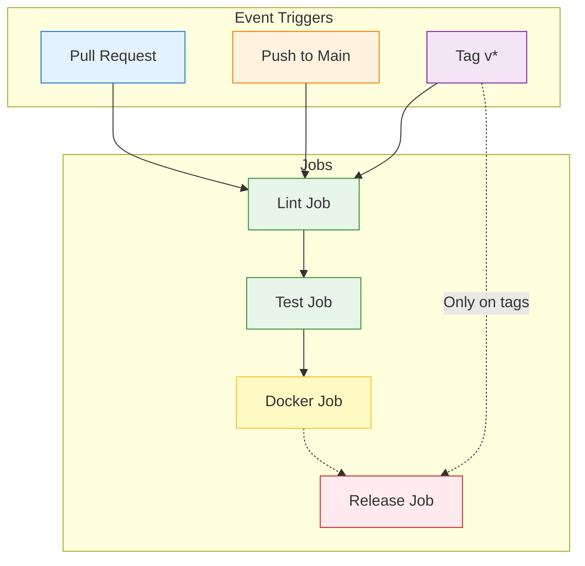
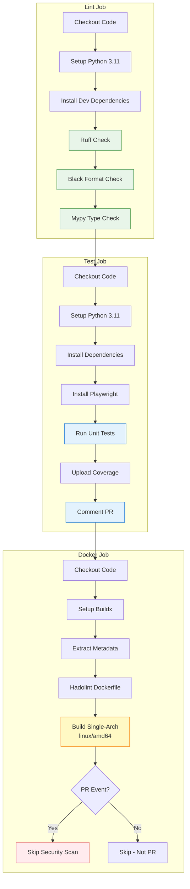
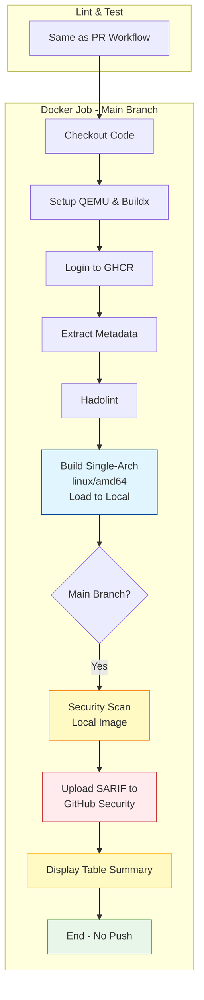
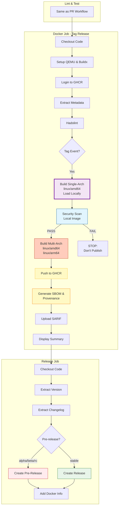

# CI/CD Workflows

This directory contains the GitHub Actions workflows for the web-to-openwebui project.

## Pipeline Architecture

The pipeline is designed with a **three-tier optimization strategy** to balance feedback speed with validation depth.

---

## Workflow Overview



---

## 1. Pull Request Workflow (Fast Feedback)

**Trigger:** Open/Sync PR to main

**Goal:** Quick validation for developers. Skips expensive operations.



**What Runs:**
- ✅ Python linting (Ruff, Black, Mypy)
- ✅ Unit tests with coverage reporting
- ✅ Docker build validation (single-arch amd64)
- ✅ Hadolint Dockerfile linting

**What's Skipped:**
- ❌ Security scanning (too slow for PR feedback)
- ❌ Multi-arch builds
- ❌ Push to registry

**Estimated Duration:** ~6 minutes

---

## 2. Push to Main Workflow (Full Validation)

**Trigger:** Merge/Push to main branch

**Goal:** Ensure the codebase is secure and stable before release.



**What Runs:**
- ✅ Complete lint & test suite
- ✅ Docker build (single-arch amd64, loaded locally)
- ✅ Trivy security scan (CRITICAL/HIGH/MEDIUM)
- ✅ Upload SARIF to GitHub Security tab
- ✅ Console security summary

**What's Skipped:**
- ❌ Multi-arch builds (we only release on tags)
- ❌ Push to registry (main doesn't publish)

**Estimated Duration:** ~10 minutes

---

## 3. Tag Release Workflow (Production Deployment)

**Trigger:** Push tag `v*` (e.g., v1.0.0, v1.2.3-beta)

**Goal:** Secure production release. Pre-flight scan prevents publishing vulnerable images.



**Key Security Feature:** Pre-flight scan prevents publishing vulnerable images!

**What Runs:**
- ✅ Complete lint & test suite
- ✅ **Pre-flight Build** (linux/amd64) - Local scan target
- ✅ **Security Scan** (local image) - Quality gate
- ✅ **Multi-arch build** (linux/amd64, linux/arm64) - Only if scan passes
- ✅ Push to GitHub Container Registry
- ✅ Generate SBOM and provenance attestations
- ✅ Upload SARIF to GitHub Security tab
- ✅ Create GitHub Release with auto-extracted changelog
- ✅ Detect pre-release tags (alpha/beta/rc)

**Security Benefit:** Vulnerable images are never published - scan happens BEFORE push.

**Estimated Duration:** ~12 minutes (pre-flight scan adds ~2 min, prevents bad releases)

---

## Conditional Logic Summary

| Condition | Lint | Test | Build Type | Security Scan | Push Registry | Release |
|-----------|------|------|------------|---------------|---------------|---------|
| **Pull Request** | ✅ | ✅ | Single-arch | ❌ | ❌ | ❌ |
| **Push to Main** | ✅ | ✅ | Single-arch | ✅ Local (CRITICAL only) | ❌ | ❌ |
| **Tag v*** | ✅ | ✅ | Single + Multi | ✅ **Pre-flight** (before push) | ✅ | ✅ |

---

## Key Optimizations

### 1. Pre-flight Security Scanning
- **Strategy:** Build → Scan → Push (not Push → Scan)
- **Benefit:** Vulnerable images never reach the registry
- **Tag Releases:** Single-arch build → Scan → Multi-arch build & push
- **Trade-off:** +2 minutes per release, but ensures security

### 2. Smart Security Scanning
- **PRs:** Skipped (fast feedback loop)
- **Main:** Scans local build (CRITICAL-only quality gate)
- **Tags:** Pre-flight scan

### 3. Aggressive Caching
- **Pip dependencies:** GitHub Actions cache
- **Docker layers:** GitHub Actions cache with `mode=max`
- **Playwright browsers:** Cached by actions/setup-python

### 4. Parallel Where Possible
- Lint job can start immediately
- Test job waits for lint (fail-fast)
- Docker job waits for both (avoid wasted builds)

---

## Security Scanning Details

### Trivy Configuration (v0.33.1)

**Scan Strategy - Pre-flight Security Gates**

**Quality Gates (Block Releases):**

**Main Branch:**
- Scans local build before merging to main
- Blocks ONLY on **CRITICAL** vulnerabilities
- HIGH/MEDIUM tracked but non-blocking

**Tag Release (Pre-flight):**
- Builds single-arch image (`linux/amd64`) locally

**Configuration:**
- **Scanners:** `vuln` only (vulnerabilities, not secrets)
- **Severity:** CRITICAL, HIGH, MEDIUM (all tracked in SARIF)
- **Blocking:** CRITICAL only (`exit-code: '1'`)
- **Ignore Unfixed:** `true` (don't fail on upstream/unpatchable issues)
- **SARIF Filtering:** `limit-severities-for-sarif: true` (required for severity to work)

**Outputs:**
1. **SARIF:** Uploaded to GitHub Security tab for all severities
2. **Table:** Console summary in workflow logs

**Best Practice:** Monitor GitHub Security tab regularly. Address CRITICAL immediately. Plan upgrades for HIGH when upstream patches available.

---

## Release Automation

### Changelog Integration

The workflow attempts to extract release notes from `CHANGELOG.md`:

```markdown
## [1.2.3] - 2024-01-15
- Feature: Added new thing
- Fix: Fixed bug

## [1.2.2] - 2024-01-10
...
```

If the version is missing from changelog, a default message is used.

### Pre-release Detection

Tags matching `-(alpha|beta|rc)` are automatically marked as pre-releases:
- `v1.0.0-alpha.1` → Pre-release ✅
- `v1.0.0-beta` → Pre-release ✅
- `v1.0.0` → Stable release

### Docker Image Tags

A release `v1.2.3` creates:
- `ghcr.io/owner/repo:v1.2.3`
- `ghcr.io/owner/repo:1.2`
- `ghcr.io/owner/repo:1`
- `ghcr.io/owner/repo:latest` (if default branch)

---

## Workflow Files

- **`ci-cd.yml`:** Main pipeline (this document describes it)
- **Future:** Separate scheduled security scanning workflow (optional)